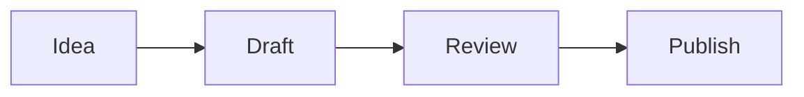

# Index

Source: index.md
URL: /

<LandingHome />

---

# First Launch

Source: start/first-launch.md
URL: /start/first-launch

# First Launch

The first launch flow is designed to get you into a real vault quickly without hiding the local-first model.

## What You Choose

Tolaria asks whether you want to:

- Create or clone the Getting Started vault.
- Open an existing local vault.
- Create a new empty vault.

The Getting Started vault is cloned locally and then disconnected from its remote. That keeps the sample safe to edit without accidentally pushing tutorial changes.

## What Tolaria Creates

Tolaria stores app-level settings on the local machine. Your notes stay in the vault folder you choose.

| Data | Stored in |
| --- | --- |
| Notes and attachments | Your vault folder |
| Type definitions and saved views | Your vault folder |
| Window size, zoom, recent vaults | Local app settings |
| Cache data | Rebuildable local cache |

## First Commands To Try

- `Cmd+K` / `Ctrl+K`: open the command palette.
- `New Note`: create a note in the current vault.
- `Open Getting Started Vault`: clone the public sample vault.
- `Reload Vault`: rescan files after external edits.

## AI Setup Prompt

Tolaria can show an optional AI agents prompt after a vault is open. It checks common local install locations for supported coding agents and gives you setup paths, but you can dismiss it and use Tolaria without AI.

---

# Getting Started Vault

Source: start/getting-started-vault.md
URL: /start/getting-started-vault

# Getting Started Vault

The Getting Started vault is a small public sample vault hosted at [refactoringhq/tolaria-getting-started](https://github.com/refactoringhq/tolaria-getting-started).

It exists to show Tolaria's conventions without requiring you to restructure your own notes first.

## What It Demonstrates

- Markdown notes with YAML frontmatter.
- Types such as Note, Project, Person, and Topic.
- Wikilinks in note bodies.
- Relationship fields in frontmatter.
- Rich-editor blocks, callouts, collapsible sections, and durable formatting.
- A spreadsheet with formulas and a cross-note frontmatter reference.
- An HTML dashboard powered by vault expressions.
- A standalone HTML report that can be previewed or edited in raw mode.
- A local Git repository that can be connected to a remote later.
- Vault guidance files plus example workflows for AI agents and direct models.

In the cloned vault, open **Editor Playground** for block editing, **Project Dashboard** for vault expressions, and **Sample Report** for standalone HTML preview.

## Local-Only By Default

When Tolaria clones the sample, it removes the remote from the local copy. This makes the sample vault disposable. You can edit it freely, commit locally, and delete it later.

To connect a vault to your own remote, use the bottom status bar remote chip or run `Add Remote` from the command palette.

Tolaria also repairs starter-vault guidance files when needed. `AGENTS.md` is the canonical guidance file, `CLAUDE.md` is kept as a compatibility shim, and `GEMINI.md` is only created when you explicitly restore Antigravity/Gemini guidance.

Start with the `Start here!` view and follow **Get familiar with Tolaria**. The checklist links to working examples, so you can try each feature without changing your own notes.

## Use It Alongside Your Own Vaults

You can keep the Getting Started vault open while working in your own notes. Enable `Settings` -> `Vaults` -> `Use multiple vaults at the same time`, then use the bottom-left vault menu to include both the sample vault and your real vault in the unified graph.

This lets search, quick open, note lists, backlinks, and wikilink navigation span both vaults. Git actions still stay scoped to each vault's own repository, and new notes go to the default vault you choose in `Manage vaults`.

## When To Move On

After you understand the sample, open your own vault. Tolaria does not require a special folder structure: a folder of Markdown files is enough to start. You can remove the sample from Tolaria's vault list later without deleting its files from disk.

---

# Install Tolaria

Source: start/install.md
URL: /start/install

# Install Tolaria

Tolaria publishes desktop builds for macOS, Windows, and Linux. macOS is the primary day-to-day development target, with Windows and Linux builds supported through the release pipeline and fixed as platform issues are found.

## Download

Use the latest stable release unless you are intentionally testing pre-release builds:

- <a href="https://tolaria.md/download/" target="_self">Download the latest stable build</a>
- [Browse all GitHub releases](https://github.com/refactoringhq/tolaria/releases)
- <a href="https://tolaria.md/releases/" target="_self">Read the release notes</a>

## Homebrew

On macOS you can install the cask:

```bash
brew install --cask tolaria
```

## Platform Status

| Platform | Status | Notes |
| --- | --- | --- |
| macOS | Primary | Apple Silicon and Intel builds are published. Homebrew is available. |
| Windows | Supported, early | NSIS installers and updater bundles are Tauri-signed. Authenticode publisher signing will be added after Windows certificate provisioning; company-managed SmartScreen, Defender, or WDAC policies can still require IT approval before install. |
| Linux | Supported, early | AppImage, deb, and RPM artifacts are published. Desktop behavior depends on distribution WebKitGTK and input-method integration. |

See [Supported Platforms](/reference/supported-platforms) for the current support policy.

## Managed Windows Devices

Do not disable SmartScreen or Windows Security to install Tolaria. On a managed Windows device, install Tolaria through your normal software approval path if policy blocks unsigned or unknown-publisher installers. After Authenticode provisioning is complete, validate that the downloaded installer has a valid Tolaria publisher signature before installing.

## After Installing

1. Open Tolaria.
2. Choose the Getting Started vault if you want a guided sample.
3. Or open an existing folder of Markdown files as a vault.
4. Use the command palette with `Cmd+K` on macOS or `Ctrl+K` on Linux and Windows.

---

# Open Or Create A Vault

Source: start/open-or-create-vault.md
URL: /start/open-or-create-vault

# Open Or Create A Vault

A Tolaria vault is a folder on disk. The folder can contain Markdown notes, attachments, type definitions, saved views, and Git metadata.

## Open An Existing Folder

Choose an existing folder if you already have Markdown notes. Tolaria scans `.md` files and uses frontmatter when it exists.

Good starting points:

- A folder of plain Markdown files.
- An Obsidian-style vault.
- A Git repository containing notes.
- A copy of the Getting Started vault.

## Create A New Vault

Choose a new empty folder if you want Tolaria conventions from the start. New notes and optional type definitions are created as Markdown files.

## Use More Than One Vault

You do not have to merge everything into one folder. Register each local folder as its own vault, then turn on `Use multiple vaults at the same time` in `Settings` -> `Vaults`.

Once enabled, the bottom-left vault menu lets you include vaults in the unified graph. Search, quick open, wikilinks, and note lists can span the included vaults, while Git sync and commits remain tied to each vault's own repository.

## Git Is Recommended, Not Required

Tolaria works well with a plain folder of Markdown files. You can open, edit, organize, and search notes without making the vault a Git repository.

Git is recommended when you want local history, diff views, recovery, pull, push, and remote sync without a proprietary backend. If a vault is not already a repository, Tolaria can initialize one when you explicitly ask it to.

---

# AI

Source: concepts/ai.md
URL: /concepts/ai

# AI

Tolaria has two AI paths: coding agents that can use tools to inspect and edit a vault, and direct model targets that answer in chat mode from note context.

## Coding Agents

The AI panel can stream supported local CLI agents through Tolaria's normalized event layer. Current targets include:

- Claude Code
- Codex
- GitHub Copilot
- OpenCode
- Pi
- Antigravity CLI
- Kiro
- Hermes Agent

Tolaria detects agents installed on the machine. Each agent still owns its authentication, available tools, and runtime behavior.

Coding agents can run in:

- **Vault Safe** mode, limited to file, search, and edit tools.
- **Power User** mode, which can allow local shell commands scoped to the active vault for agents that support shell access.

## Agent Models

Agents that expose a reliable model catalog can show a model selector in the AI workspace. Tolaria currently discovers Codex models and exposes Claude Code's documented aliases. Other agents continue to use their own default model.

Model preferences are stored per agent on the current device. Switching agents restores that agent's previous choice, and selecting **Agent default** lets the CLI decide.

## Direct Models

Direct model targets run in chat mode. They receive the active note, linked context, and conversation history, but they do not receive vault-write tools or shell access.

Supported provider shapes include:

- Local models through Ollama or LM Studio.
- Hosted providers such as OpenAI, Anthropic, Gemini, and OpenRouter.
- Custom OpenAI-compatible endpoints.

## External MCP Setup

Tolaria exposes an MCP server for external tools. The setup flow can write Tolaria's MCP entry into Claude Code, Antigravity CLI, Cursor, and a generic MCP config path, and it can also copy the exact JSON snippet for manual setup.

MCP setup is explicit. Closing the dialog leaves third-party config files untouched.

The MCP server can search and read vault content, create notes, update a complete note, or append content to an existing note. `update_note` supports an optional modification-time guard for safer read-modify-write workflows, and both write operations refresh Tolaria after the file changes.

## Why Git Matters For AI

AI-generated changes should be inspectable. Git gives you diffs, history, rollback, and a clear boundary between suggestions and committed work.

---

# Editor

Source: concepts/editor.md
URL: /concepts/editor

# Editor

Tolaria offers a rich editor for daily writing and a raw Markdown mode for exact file control. Both modes write back to the same Markdown file.

## Rich Editing

The rich editor supports blocks, slash commands, wikilinks, tables, code blocks, editable callouts, images, Mermaid diagrams, LaTeX-style math, sandboxed HTML blocks, and markdown-backed whiteboards.

Use it when you want to write and reorganize quickly without thinking about Markdown syntax.

Headings and list items can collapse long sections without changing the Markdown file. Block selection lets you move, copy, cut, paste, or delete whole blocks—including the hidden content inside a collapsed section.

See [Use The Rich Editor](/guides/use-rich-editor) for date and time commands, block selection, collapsible sections, callouts, code blocks, highlights, and their shortcuts.

## HTML Blocks

HTML blocks render fenced `html` code as sandboxed previews. They are useful for dashboards, report fragments, custom layouts, and small interactive local views.

HTML source is edited in raw mode. The rich editor shows the preview, copy source action, raw-editor action, height reset, and resize handle.

HTML blocks can read vault values with `{{...}}` expressions, including current-note properties, external note properties, sheet cells, raw body lines, formatting helpers, and structured `json(...)` data for sandboxed scripts.

See [Use HTML Blocks](/guides/use-html-blocks) for the workflow and [Vault Expressions](/reference/vault-expressions) for the syntax.

## Raw Mode

Raw mode shows the Markdown source directly. Use it when you need to edit YAML frontmatter, repair unusual Markdown, or make an exact text change.

Toggle raw mode with `Cmd+\` on macOS or `Ctrl+\` on Windows and Linux.

Tolaria highlights invalid YAML frontmatter in raw mode so malformed metadata is easier to locate and repair.

## Table Of Contents

The table of contents panel builds an outline from headings in the current note. It is useful for long notes, procedures, research files, and generated documents. Toggle it with `Cmd+Shift+T` on macOS or `Ctrl+Shift+T` on Windows and Linux.

## Width

Notes can use normal or wide editor width. Set the default in Settings, or override an individual note from the editor toolbar.

---

# Files And Media

Source: concepts/files-and-media.md
URL: /concepts/files-and-media

# Files And Media

Tolaria starts with Markdown notes, but a vault can also contain images, PDFs, media files, whiteboards, and other local files.

## Mermaid Diagrams

Use Mermaid code blocks when a note needs a diagram that should stay plain text and versionable.

````md

````

Tolaria renders Mermaid diagrams in the editor while keeping the source in Markdown.

## Attachments

Images pasted into the editor are saved into the vault as normal files. They remain portable and can be opened by other tools.

When pasted web content contains eligible remote images, Tolaria imports those images into `attachments/` in the background and rewrites the pasted references to local paths. Text appears immediately. If an image cannot be imported safely, its original remote reference remains editable instead of blocking the paste.

## Previews

Tolaria can preview common image files, PDFs, and supported media files in the app. Files without an in-app preview can still be opened in the default system app.

Settings control whether PDFs, images, and unsupported files appear in All Notes. Folder browsing still shows files in their folders.

## HTML Files

Standalone `.html` and `.htm` files can open in a sanitized in-app preview. Local images, styles, fonts, and media work when their paths stay inside the vault.

Preview mode removes scripts, forms, nested frames, and remote resources. Use raw mode to edit the source, or open the file in the default browser when it needs interactive browser behavior.

## Whiteboards

Whiteboards use tldraw in the editor, but their durable representation stays in Markdown. That keeps them inside the vault and versioned by Git with the rest of your notes.

## Git Boundary

If generated or local-only files are ignored by Git, Tolaria can hide them from notes, search, quick open, and folders. Use this when build artifacts or private local files should not behave like vault content.

---

# Git

Source: concepts/git.md
URL: /concepts/git

# Git

Git is Tolaria's recommended history and sync layer. Tolaria can work with plain Markdown folders, and Git unlocks local history, recovery, remote backup, and multi-device workflows when you want them.

Tolaria acts as a lightweight Git client for your vault. You can review changes, commit, pull, push, and inspect history without leaving the app.

## What Tolaria Uses Git For

- Whole-vault commit history.
- Current diff for the vault.
- Per-note history.
- Current diff for an individual note.
- Pull and push.
- Conflict detection and resolution.
- Remote connection for local-only vaults.

## History And Diffs

Each note can show its own history and current diff, so you can understand how that file changed over time or what is unsaved relative to Git.

Tolaria also shows a history of the whole vault. Use it when you want to review broader changes across multiple notes before committing or syncing.

## Local Commits

You can commit changes inside Tolaria without leaving the app. This gives you useful restore points even before a remote is configured.

## Remotes

Connect a compatible Git remote when you want sync or backup. Tolaria relies on your system Git authentication, so GitHub CLI, SSH keys, credential helpers, and existing Git configuration can continue to work.

## Vaults Inside A Parent Repository

A vault can be a folder inside a larger Git repository. Tolaria discovers the nearest parent work tree but keeps the selected vault as the content boundary:

- status, diffs, history, and app-created commits include only vault files
- files elsewhere in the repository do not appear as Tolaria notes
- pull, push, branch, merge, and rebase state still belong to the whole repository

The resolved Git root is visible in Settings when it differs from the vault root.

---

# Inbox

Source: concepts/inbox.md
URL: /concepts/inbox

# Inbox

The Inbox is for notes that have been captured but not yet organized.

## Why It Exists

Fast capture should not require perfect structure. The Inbox gives you a place to put incomplete notes, then process them later.

The Inbox workflow is optional. Turn it off in Settings > Workflow if you prefer every note to appear organized by default.

## Organizing Inbox Notes

When reviewing the Inbox:

1. Give the note a clear H1.
2. Set its `type`.
3. Add status, dates, or URL if useful.
4. Add relationships with wikilinks or frontmatter fields.
5. Move it into a folder only if the folder adds value.

## Healthy Inbox Habit

Keep the Inbox small enough that it can be reviewed in one focused pass. Tolaria works best when capture is fast and organization is deliberate.

---

# Notes

Source: concepts/notes.md
URL: /concepts/notes

# Notes

A note is a Markdown file with optional YAML frontmatter. Tolaria reads the first H1 as the primary title and keeps the file on disk as the durable representation.

## Anatomy

```md
---
type: Project
status: Active
belongs_to:
  - "[[workspace]]"
---

# Launch Documentation

Draft the public Tolaria docs and keep them close to code changes.
```

## Titles

The first H1 is the note title. Tolaria uses that title wherever the note is displayed: note lists, search results, wikilink suggestions, relationship pickers, tabs, and window titles.

The title is separate from the filename. The filename stays visible in the breadcrumb so you can see the file on disk, and you can rename it independently when needed.

Use the breadcrumb action to rename the file to match the title. New untitled notes can also auto-rename from the first H1 the first time they get a real title. Turn this behavior off in Settings > Vault Content > Titles & Filenames if you prefer filenames to stay unchanged until you rename them manually.

## Body Links

Use `[[wikilinks]]` to connect notes from the body. Tolaria shows autocomplete suggestions while you type, and links can resolve by filename or title.

## Frontmatter

Use frontmatter for structured fields such as type, status, date, URL, and relationships. Keep free-form thinking in the body.

Some notes can be displayed with specialized editors while keeping the same file-first model. A note with `_display: sheet` opens as a spreadsheet and stores its cells in a CSV-like body, while `type` remains available for organization. See [Spreadsheets](/concepts/spreadsheets).

---

# Properties

Source: concepts/properties.md
URL: /concepts/properties

# Properties

Properties are frontmatter fields that Tolaria can display, filter, and edit.

## Suggested Properties

Suggested properties are the fields Tolaria knows how to create quickly from the Properties panel. When a suggested property is missing, the panel shows a shortcut to add it with the right editor.

| Field | Purpose |
| --- | --- |
| `type` | Groups the note into a type such as Project, Person, or Topic. |
| `status` | Tracks lifecycle state such as Active, Done, or Blocked. |
| `url` | Stores a canonical external link. |
| `date` | Represents a single date. |

## System Properties

Fields that start with `_` are system properties. They remain in plain text but are hidden from normal property editing.

Examples include `_icon`, `_color`, `_order`, `_sidebar_label`, `_width`, `_pinned_properties`, and `_list_properties_display` on type documents or notes.

Type documents use `_pinned_properties` to choose which fields appear in the editor inline bar and `_list_properties_display` to choose which fields appear in note-list rows.

## Property Editing

The Properties panel is the safest place to edit structured properties. Toggle it with `Cmd+Shift+I` on macOS or `Ctrl+Shift+I` on Windows and Linux.

Date fields use Tolaria's picker, relationship fields can use wikilinks, and raw Markdown mode is available when you need direct control over YAML.

## Referencing Properties

HTML blocks can reference properties from the current note or another note:

```html
<p>{{status}}</p>
<p>{{formatDate(date, "long")}}</p>
<p>{{[[project-alpha]].status}}</p>
```

Sheet formulas can also read scalar properties with the same note target form:

```txt
=[[project-alpha]].status
```

Use [Vault Expressions](/reference/vault-expressions) for HTML expression syntax and [Spreadsheet Formulas](/reference/spreadsheet-functions) for formula behavior.

---

# Relationships

Source: concepts/relationships.md
URL: /concepts/relationships

# Relationships

Relationships make a vault feel like a graph instead of a pile of documents.

## Relationship Fields

Any frontmatter field containing wikilinks can become a relationship. Relationship fields can point to one note or to an array of notes.

```yaml
belongs_to:
  - "[[product-work]]"
related_to:
  - "[[documentation]]"
  - "[[editor-research]]"
blocked_by:
  - "[[release-process]]"
  - "[[sync-conflicts]]"
```

Tolaria supports default relationship fields out of the box: `belongs_to`, `has`, and `related_to`. It also detects custom relationship fields dynamically when they contain wikilinks.

Default relationships have automatically computed inverses. If a note says it `belongs_to` a project, the project can show that note under its inverse `has` relationship without you writing the reverse link by hand. `related_to` works as a lateral relationship in both directions.

These outgoing and inverse relationships appear in the Properties panel and in Neighborhood mode, where the note list becomes a graph view around the selected note.

## Body Links Versus Relationship Fields

Use body links when the relationship appears naturally in writing. Use frontmatter relationships when the connection is important enough to show in navigation, filters, Neighborhood mode, or the Properties panel.

## Backlinks

Tolaria can show incoming links and inverse relationships, making it easier to navigate from a note to the rest of its context.

---

# Spreadsheets

Source: concepts/spreadsheets.md
URL: /concepts/spreadsheets

# Spreadsheets

Tolaria sheets are spreadsheet notes. They keep the same file-first model as other notes, but a note with `_display: sheet` opens in a spreadsheet editor instead of the rich text editor. The note's `type` remains available for organization.

The durable file is still Markdown with YAML frontmatter. The body is CSV-like text containing cell inputs and formulas, and spreadsheet presentation state is stored as plain YAML under `_sheet`.

## Read Next

- [Use Spreadsheets](/guides/use-spreadsheets) for the editing workflow.
- [Spreadsheet File Format](/reference/spreadsheet-format) for the plain-text storage contract.
- [Spreadsheet Formulas](/reference/spreadsheet-functions) for formula syntax, autocomplete, and IronCalc function families.

## Why Sheet Notes

Sheets are useful when information is better modeled as rows, columns, and formulas than as prose. Examples include budgets, revenue models, inventories, editorial calendars, lightweight trackers, and analytical scratchpads.

Tolaria does not store sheets as opaque workbook binaries. A sheet should remain:

- readable in a text editor
- diffable in Git
- editable by humans and AI agents
- available offline
- connected to the rest of the vault through types, properties, relationships, and wikilinks

## One Note, One Sheet

A sheet note is a single sheet. Tolaria does not expose multiple tabs inside one note.

When a model needs more than one table, create more than one sheet note and connect them with wikilinks or cross-sheet formulas. This keeps each file small, legible, and aligned with Tolaria's graph model.

For example:

- `newsletter-revenue.md`
- `sponsorship-pipeline.md`
- `refactoring-business-plan.md`

Each can be a normal `_display: sheet` note, and formulas can reference cells in another sheet note with Tolaria's wikilink cell syntax.

## Editing

The interactive sheet editor is backed by IronCalc. Tolaria uses IronCalc for spreadsheet behavior and formula evaluation, then adapts the workbook back to Tolaria's plain-text note format.

In the sheet editor:

- cell inputs that start with `=` are formulas
- non-formula cells can contain normal text, numbers, dates, and `[[wikilinks]]`
- typing `[[` in a cell opens the same note autocomplete concept used elsewhere in Tolaria
- typing a formula function name opens inline formula autocomplete for the bundled IronCalc function catalog
- right-clicking a selection exposes core formatting controls such as number formats, decimal precision, bold, italic, and clear formatting

Keyboard basics follow spreadsheet conventions:

- arrow keys move the active cell
- `Shift` with arrows extends the selection
- `Enter` starts editing the active cell
- `Escape` exits cell editing while keeping focus in the sheet
- `Delete` or `Backspace` clears the selected range
- copy and paste should preserve formulas, including Tolaria cross-sheet references

## Wikilinks In Cells

Wikilinks in non-formula cells are stored as normal Tolaria wikilinks:

```csv
Project,Owner,Status
[[website-redesign]],[[person/alice]],Active
[[sponsorship-pipeline]],[[person/matteo]],Review
```

The cell still behaves like a spreadsheet cell, but the value remains a vault link that Tolaria can understand.

## Note Reference Formulas

Tolaria adds a sheet-note reference syntax on top of IronCalc formulas:

```txt
=[[newsletter-revenue]].B5
=SUM(B2:D2)+[[sponsorship-pipeline]].E12
=[[refactoring-business-plan]].$C$18
```

The target before the dot is a normal Tolaria wikilink target. For another sheet note, the part after the dot is an A1-style cell address.

Relative and absolute references work like spreadsheet references when copied:

- `[[revenue]].B5` can shift when pasted to another cell
- `[[revenue]].$B$5` stays fixed
- `[[revenue]].B$5` fixes the row
- `[[revenue]].$B5` fixes the column

This is not the same as an IronCalc workbook tab reference. It is Tolaria-specific syntax for referencing another sheet note in the vault.

Current cross-sheet formulas resolve single cells. Ranges across sheet notes are not a stable file-format feature yet, so prefer composing them from explicit cell references or keeping range formulas inside the same sheet note.

Sheet formulas can also read scalar frontmatter properties from a note:

```txt
=[[device]].power.watts
=[[project-alpha]].status
```

This keeps sheet models connected to ordinary Tolaria metadata without requiring a saved view or query. Unresolved, ambiguous, or non-scalar property references show spreadsheet errors.

Formulas can also read a raw Markdown body line from another note:

```txt
=[[launch-brief]].2
```

Line references are useful when a normal text note is still the source of record. `[[note]].A1` keeps grid or cell semantics; `[[note]].1` returns the whole first body line and preserves commas as text.

## Storage

A minimal sheet note looks like this:

```md
---
type: Project
_display: sheet
status: Draft
belongs_to:
  - "[[business-plan]]"
_sheet:
  frozen_rows: 1
  columns:
    A:
      width: 180
  cells:
    E6:
      num_fmt: "0.00%"
---
Metric,January,February,March,Q1 Total
Subscriptions,1200,1350,1500,=SUM(B2:D2)
Services,800,900,750,=SUM(B3:D3)
Expenses,650,700,760,=SUM(B4:D4)
Net,=B2+B3-B4,=C2+C3-C4,=D2+D3-D4,=SUM(B5:D5)
Growth,,=(C5-B5)/B5,=(D5-C5)/C5,=(E5-B5)/B5
```

Normal frontmatter stays normal Tolaria metadata. `_sheet` is system metadata for the spreadsheet editor and is hidden from normal property editing.

For the full storage contract, see [Spreadsheet File Format](/reference/spreadsheet-format).

## Formulas

Tolaria delegates formula calculation to IronCalc. IronCalc aims for Excel-compatible formulas, while its project documentation still describes it as work in progress. For Tolaria-specific formula behavior and the autocomplete function catalog, see [Spreadsheet Formulas](/reference/spreadsheet-functions).

---

# Types

Source: concepts/types.md
URL: /concepts/types

# Types

Types describe what kind of thing a note represents: Project, Person, Topic, Procedure, Event, or any category you create.

## Type Field

The `type:` field assigns a note to a type.

```yaml
type: Project
```

Tolaria does not infer type from folder location. Moving a file into another folder does not change its type.

## Prefer Types Over Folders

Types are the preferred way to group notes in Tolaria. Folders are supported for existing vaults and fallback organization, but Tolaria is built around types and relationships because they carry stronger meaning than file paths.

Use types for semantic groups such as Projects, People, Topics, Procedures, Events, and Essays. Use relationships to connect notes across those groups. This gives Tolaria better structure for navigation, filtering, properties, templates, and future automation than folder location alone.

## Type Documents

Type documents are Markdown notes with `type: Type` in frontmatter. They describe how a type should appear and what new notes of that type should start with.
Use Phosphor icon names in kebab-case for `_icon`, such as `folder` or `briefcase`.

```yaml
---
type: Type
_icon: folder
_color: blue
_sidebar_label: Projects
_order: 10
---

# Project
```

Type templates can live in the Type document's `template` frontmatter field. When a hand-edited Type body contains template-like structure after its own `# TypeName` heading, Tolaria also uses that body content as the new-note template. Plain descriptive body text stays documentation-only.

## What Types Control

- Sidebar grouping.
- Type icon and color.
- Sidebar order and label.
- Pinned properties.
- New-note templates.

## New Note Defaults

Type documents can define empty properties and relationships. When you create a new note of that type, Tolaria shows placeholders for those fields so you can fill them in from the Properties panel.

If a type document gives a property a value, that value becomes the default for new notes of that type. For example, a Project type can define `status: Active` so every new project starts active until you change it.

---

# Vaults

Source: concepts/vaults.md
URL: /concepts/vaults

# Vaults

A vault is the folder Tolaria reads and writes. The filesystem is the source of truth; the app state and cache are derived from files.

## Core Rules

- Notes are Markdown files.
- YAML frontmatter provides structure.
- Attachments are normal files inside the vault.
- Type definitions and saved views are also files.
- Git can track history and support remote sync.

## Why Local Files Matter

Local files keep your notes inspectable. You can open them in another editor, search with command-line tools, back them up with your own system, and version them with Git.

Tolaria should never become the only way to read your data.

## Git Is A Capability

A plain folder of Markdown files can open as a vault. Git-backed vaults unlock history, changes, commits, pull, push, conflict handling, and remote setup.

If a folder is not a Git repository, Tolaria can initialize Git when you explicitly ask it to. It avoids initializing broad personal folders such as Desktop, Documents, or Downloads unless they are clearly dedicated vault folders.

## Multiple Vaults At The Same Time

Tolaria can load multiple registered vaults into one unified graph. Enable this from `Settings` -> `Vaults` -> `Use multiple vaults at the same time`.

After the option is enabled, open the bottom-left vault menu to include or exclude vaults from the graph. Included vaults appear together in note lists, search, quick open, backlinks, and wikilink navigation. Each note keeps a compact vault badge when Tolaria needs to disambiguate where it lives.

The selected vault still matters. Git status, commits, sync, folder navigation, saved views, and vault repair actions stay scoped to the current repository. Use `Manage vaults` from the vault menu or the Vaults settings section to rename vaults, choose colors, and set the default destination for new notes.

Cross-vault wikilinks use the target vault's stable alias when needed, for example `[[team/projects/alpha]]`. Links inside the same vault stay normal vault-relative links.

## App State Versus Vault State

Vault-level information should travel with the vault. Machine-specific preferences stay with the app installation.

| Vault state | App state |
| --- | --- |
| Type icons and colors | Editor zoom |
| Saved views | Window size |
| Pinned properties | Recent vault list |
| Relationship conventions | Local cache |
| Vault AI guidance files | AI target selection |

---

# Build Custom Views

Source: guides/build-custom-views.md
URL: /guides/build-custom-views

# Build Custom Views

Custom views are saved filters for recurring questions.

## Good View Candidates

- Active projects.
- People without a recent follow-up.
- Drafts ready for review.
- Notes changed this week.
- Events in a date range.

## View Definition

Saved views live as files in the vault. They describe filters, sorting, and visible columns using structured data.

## Filters

Custom views can use nested conditions, similar to Notion or Airtable filter groups. Combine `all` and `any` logic when a view needs to answer a more precise question than a single field filter can express.

Date filters support dynamic natural-language values such as `today`, `yesterday`, or `one week ago`. Use these for views that should keep moving over time, such as recent work, stale follow-ups, or upcoming events.

## Design The Question First

Before creating a view, write the question it answers. A good view is not "all fields with all filters"; it is a focused lens.

---

# Capture A Note

Source: guides/capture-a-note.md
URL: /guides/capture-a-note

# Capture A Note

Use capture when you need to get an idea into the vault before you know where it belongs.

## Steps

1. Press `Cmd+N` on macOS or `Ctrl+N` on Windows and Linux.
2. Write a clear H1.
3. Add the rough content.
4. Leave structure for later if you are still thinking.

## Capture Well

Prefer a useful title over a perfect taxonomy. You can add type, status, and relationships during inbox review.

## When To Add Structure Immediately

Add structure while capturing when the note's type or relationships are already obvious. Otherwise, capture the idea first and organize it later.

---

# Manage Git Manually Or With AutoGit

Source: guides/commit-and-push.md
URL: /guides/commit-and-push

# Manage Git Manually Or With AutoGit

Tolaria can act as a lightweight Git client for a Git-enabled vault. You can manage commits and pushes yourself, or enable AutoGit to create conservative checkpoints after editing pauses or when the app is no longer active.

## Manual Git

1. Open the Git or changes surface.
2. Review changed files.
3. Write a short commit message.
4. Commit locally.
5. Push when a remote is configured.

If the remote has changed, pull first and resolve any conflicts. If the vault has no remote, manual commits still give you local history, diffs, and rollback.

## AutoGit

AutoGit is available in Settings for Git-enabled vaults. When enabled, Tolaria automatically commits and pushes saved local changes after an idle pause or after the app becomes inactive.

Use AutoGit when you want the safety of regular checkpoints without interrupting capture or editing. You can still inspect each note's current diff, review note history, and browse the whole-vault history before making larger manual commits.

## Use Small Commits

Small commits make it easier to understand what changed, roll back safely, and review AI-generated edits.

---

# Configure AI Models

Source: guides/configure-ai-models.md
URL: /guides/configure-ai-models

# Configure AI Models

Use model providers when you want chat over note context without giving an agent vault-write tools.

## Local Models

Local model targets are for tools such as Ollama and LM Studio. They usually need a base URL and model ID, and they usually do not need an API key.

## API Models

API model targets are for hosted providers such as OpenAI, Anthropic, Gemini, OpenRouter, or another OpenAI-compatible endpoint.

Tolaria does not store provider API keys in vault settings. Choose one of the supported key paths:

- Save the key locally on this device.
- Read the key from an environment variable.
- Use no key for local providers that do not require one.

## Test The Connection

After adding a provider, use the test action in Settings. A successful test means Tolaria reached the endpoint and the model replied.

## Select The Target

Once configured, choose the model from the AI target selector or set it as the default AI target in Settings.

---

# Connect A Git Remote

Source: guides/connect-a-git-remote.md
URL: /guides/connect-a-git-remote

# Connect A Git Remote

Connect a remote when you want backup or sync beyond the current machine.

## Before You Start

Make sure the remote repository exists and your system Git can authenticate to it. Tolaria uses system Git rather than storing provider-specific credentials.

## Steps

1. Open the bottom status bar remote chip, or run `Add Remote` from the command palette.
2. Paste the remote URL.
3. Confirm the remote name.
4. Fetch or push according to the app prompt.

## Recommended Auth

- SSH keys.
- GitHub CLI authentication.
- Existing Git credential helpers.
- macOS Keychain credentials for HTTPS remotes on macOS.

If authentication fails, see [Git Authentication](/troubleshooting/git-auth).

---

# Create Types

Source: guides/create-types.md
URL: /guides/create-types

# Create Types

Create a type when several notes share the same role in your system.

## Steps

1. Run `New Type` from the command palette, or click `+` in the Types header in the sidebar.
2. Give the type a clear name.
3. Add optional icon, color, sidebar order, sidebar label, pinned properties, suggested fields, default values, or a new-note template.

You can also right-click a type in the sidebar to change its icon and color.
Type icons use Phosphor icon names in kebab-case, such as `briefcase` or `folder`.

```yaml
---
type: Type
_icon: briefcase
_color: blue
_sidebar_label: Projects
_order: 10
---

# Project
```

## Use Types Sparingly

A type should represent a recurring category, not a one-off label. If you only need a temporary grouping, use a saved view or property instead.

## Templates

Type documents can include a Markdown template for new notes of that type. Keep templates small and useful: a heading, a few expected fields, and the first checklist are usually enough.

You can store the template in the Type document's `template` frontmatter field. When hand-editing the Type document body, content after the Type note's own `# TypeName` heading is also used as the new-note template if it looks like template structure such as field labels, secondary headings, or checklist starters. Plain descriptive body text is ignored.

Type documents can also define fields for new notes. Empty properties and relationships become placeholders in new notes of that type. Properties with values become defaults for new notes of that type.

---

# Manage Display Preferences

Source: guides/manage-display-preferences.md
URL: /guides/manage-display-preferences

# Manage Display Preferences

Display preferences live in local app settings unless a setting is intentionally stored in the note or vault.

## Theme

Choose Light, Dark, or System in Settings. System follows the operating system appearance at runtime.

You can also switch theme mode from the command palette.

## Note Width

Set the default rich-editor width in Settings:

- **Normal** for focused writing.
- **Wide** for tables, diagrams, dense notes, and generated documents.

An individual note can override the default width from the editor toolbar. That override is stored as `_width` in the note frontmatter.

## Sidebar Labels

Tolaria can pluralize type names in the sidebar. Turn this off in Settings if your type names should be shown exactly as written, or use `_sidebar_label` on a type document for an explicit label.

## Vault Content

Settings also control whether Gitignored files and non-Markdown file categories are visible in the app. Use these controls to keep generated or local-only files out of regular note workflows.

---

# Organize The Inbox

Source: guides/organize-inbox.md
URL: /guides/organize-inbox

# Organize The Inbox

Inbox review turns quick captures into usable knowledge.

## Remove A Note From Inbox

When a note is organized enough, mark it as organized. Use `Cmd+E` on macOS or `Ctrl+E` on Windows and Linux, or click the organize action in the breadcrumb bar.

That action is what removes the note from Inbox. If auto-advance is enabled in Settings > Workflow, Tolaria opens the next Inbox item immediately after you mark the current note organized.

## Review Checklist

- Rename unclear notes.
- Add or correct the first H1.
- Set `type`.
- Add `status` for actionable notes.
- Add `belongs_to`, `related_to`, or other relationship fields when useful.
- Archive or delete notes that no longer matter.

## Make Notes Navigable

A note is organized when you can answer:

- What kind of thing is this?
- What is it connected to?
- What is this useful for?
- What will I do with it?

## Avoid Over-Structuring

Do not add fields just because they exist. Add the structure that will help future navigation, review, or automation.

---

# Use The AI

Source: guides/use-ai-panel.md
URL: /guides/use-ai-panel

# Use The AI

Tolaria gives you two ways to ask for AI help: open the AI panel for an ongoing conversation, or prompt directly from the editor with `Cmd+K` followed by a space.

## Choose How To Prompt

- **AI panel** is best for longer conversations, agent work, and requests that need visible back-and-forth.
- **Inline prompt** is best when you are already writing. Press `Cmd+K`, type a space, then write the prompt you want the AI to handle from the current note context.

## Choose A Target

Open Settings and choose the default AI target:

- **Coding agent** for tool-backed vault editing through Claude Code, Codex, GitHub Copilot, OpenCode, Pi, Antigravity CLI, Kiro, or Hermes Agent.
- **Local model** for Ollama or LM Studio chat over note context.
- **API model** for OpenAI, Anthropic, Gemini, OpenRouter, or an OpenAI-compatible endpoint.

If a coding agent is missing, install it and reopen Tolaria or switch to another target.

## Choose An Agent Model

Some coding agents expose a model picker in the AI workspace. Choose **Agent default** to let the CLI decide, or select one of the models reported by the installed agent.

Tolaria remembers the choice separately for each agent. If an agent removes a previously selected model, Tolaria falls back to **Agent default** instead of sending an obsolete model ID.

## Permission Mode

Coding agents support per-vault permission modes:

- **Vault Safe** keeps agents limited to file, search, and edit tools.
- **Power User** can allow shell commands for agents that support them.

Direct model targets always stay in chat mode. They can use note context, but they cannot edit vault files through tools.

## Good Requests

- "Find notes related to this project."
- "Summarize what changed in this note."
- "Draft a weekly review from these linked notes."
- "Update this checklist based on the current project status."

## Review Changes

AI edits are file edits. Review them with Tolaria's diff and Git history before committing.

Use the stop control when a request is no longer useful or an agent is taking the wrong direction. Stopping ends the active stream without changing the target for your next request.

---

# Use The Command Palette

Source: guides/use-command-palette.md
URL: /guides/use-command-palette

# Use The Command Palette

The command palette is the fastest way to move around Tolaria.

Open it with:

- `Cmd+K` on macOS.
- `Ctrl+K` on Linux and Windows.

## Common Commands

- New Note.
- Search.
- Open Settings.
- Reload Vault.
- Add Remote.
- Open Getting Started Vault.
- Toggle Raw Mode.
- Toggle Table of Contents.
- Toggle AI Panel.
- Use Light, Dark, or System theme.
- Open in New Window.

## Keyboard-First Workflow

Use the palette when you know what you want to do but do not want to hunt through panels. It is also the best place to discover commands as the app grows.

---

# Use HTML Blocks

Source: guides/use-html-blocks.md
URL: /guides/use-html-blocks

# Use HTML Blocks

HTML blocks render fenced `html` code as sandboxed previews inside a note. Use them for local dashboards, report fragments, small custom layouts, and presentation-oriented views that should stay in the vault as Markdown.

## Create An HTML Block

Insert an HTML block from the slash menu, or write a fenced `html` block in raw mode:

````md
```html height="360"
<style>
  .metric { font-weight: 700; }
</style>

<section>
  <h2>Project status</h2>
  <p class="metric">{{status}}</p>
</section>
```
````

The `height` attribute controls the preview height. You can also resize the block from the rich editor. Source editing happens in raw mode, so the rich editor preview stays read-only.

## Add Live Vault Values

HTML block source can include vault expressions inside `{{...}}`. Tolaria resolves them before the HTML is sanitized and rendered.

```html
<p>Status: {{status}}</p>
<p>Published: {{formatDate(publish_date, "long")}}</p>
<p>Owner: {{[[project-alpha]].owner}}</p>
<p>Budget: {{formatCurrency([[project-budget]].B2, "USD", 0)}}</p>
<p>Summary line: {{[[launch-brief]].2}}</p>
```

Use current-note properties directly, such as `{{status}}`, or use `{{this.status}}` when you want to be explicit. Use `[[note]].property`, `[[note]].A1`, or `[[note]].2` to read another note's property, sheet cell, or raw body line.

See [Vault Expressions](/reference/vault-expressions) for the full syntax and formatting helpers.

## Style The Preview

Inline `style` attributes and `<style>` tags work. Tolaria places sanitized style blocks in the iframe head so CSS applies to the whole preview.

Remote loading is intentionally blocked. External stylesheets, CSS `@import`, CSS `url(...)`, remote scripts, nested frames, workers, forms, and network requests are removed or blocked by the sandbox.

## Run Local Script

Scripts are blocked by default. Opt into an opaque-origin script sandbox only when the block needs local DOM rendering:

````md
```html height="520" scripts="sandboxed"
<div id="notes"></div>

<script type="application/json" id="notes-data">
{{json([[essay]].has_notes)}}
</script>

<script>
  const notes = JSON.parse(document.getElementById("notes-data").textContent || "[]");
  const list = document.createElement("ul");

  for (const note of notes) {
    const item = document.createElement("li");
    const link = document.createElement("a");
    link.href = note.deepLink || "#";
    link.textContent = note.title;
    item.append(link);
    list.append(item);
  }

  document.getElementById("notes").replaceChildren(list);
</script>
```
````

`json(...)` returns safely escaped JSON. When the value is a wikilink or a relationship list of wikilinks, Tolaria enriches it with note metadata such as `title`, `status`, `path`, `target`, `raw`, and `deepLink`.

The script sandbox is still constrained. It can use standard DOM APIs inside the preview, but it cannot access the parent Tolaria window, Tauri APIs, same-origin storage, remote network data, external script files, workers, forms, or nested frames.

## Troubleshooting

If a `{{...}}` expression stays visible, Tolaria could not parse or resolve it. Check the note target, property name, function arguments, or whether the referenced note is ambiguous.

If script code appears not to run, confirm the fence has `scripts="sandboxed"` and that the script is inline. External `src` scripts are not supported.

If styling does not apply, put the CSS in a `<style>` tag or inline `style` attribute and avoid remote CSS imports or `url(...)` assets.

---

# Use Media Previews

Source: guides/use-media-previews.md
URL: /guides/use-media-previews

# Use Media Previews

Media previews let you inspect vault files without leaving Tolaria.

## Open A File

Select an image, PDF, media file, HTML file, or unsupported file from a folder or file list. Tolaria opens supported files in the app and offers an external-open action for files that should use the system default app.

Standalone HTML files open as sanitized previews. Toggle raw mode to edit their source, and use the external-open action when a page needs scripts, forms, remote resources, or other browser behavior that the safe preview intentionally disables.

## All Notes Visibility

Open Settings to choose whether non-Markdown files appear in All Notes:

- PDFs.
- Images.
- Unsupported files.

Folder browsing still shows files in their folders even when a category is hidden from All Notes.

## Attachments

When you paste or drop an image into a note, Tolaria copies it into the vault and references the copied file from Markdown.

When you paste a selection from a web page, Tolaria also tries to import public `http` and `https` images into the vault. The text is pasted immediately while image imports finish in the background. Successful imports become portable `attachments/...` references; failed imports remain remote and produce a non-blocking message.

## Troubleshooting

If a preview does not render, open the file in the default app to confirm the file is valid, then check whether the file is inside the active vault and not blocked by operating-system permissions.

If a pasted web image stays remote, the host may have rejected the download, the response may not be a supported image, or the URL may have failed Tolaria's local-network and size safety checks.

---

# Use The Rich Editor

Source: guides/use-rich-editor.md
URL: /guides/use-rich-editor

# Use The Rich Editor

Tolaria's rich editor gives you block-based editing while keeping the note as portable Markdown. Use these workflows to move quickly without losing access to the underlying file.

## Insert Common Blocks

Type `/` on an empty line to open the slash menu. Useful commands include:

- headings, lists, quotes, and dividers
- todo blocks
- code blocks
- tables
- the current date
- the current time

Use `Cmd+T` on macOS or `Ctrl+T` on Windows and Linux to toggle the current block between a paragraph and a todo.

## Select And Move Whole Blocks

Press `Esc` while editing to select the current block. While block selection is active:

- `Up` and `Down` move the selection.
- `Shift+Up` and `Shift+Down` extend it.
- `Enter` returns to text editing.
- `Cmd+Shift+Up` and `Cmd+Shift+Down` move selected blocks on macOS. Use `Ctrl+Shift+Up` and `Ctrl+Shift+Down` on Windows and Linux.
- Copy, cut, paste, and delete operate on the selected blocks.

Collapsed heading content travels with its heading when you copy, cut, delete, or move the selected section.

## Collapse Long Sections

Headings can hide the content below them until the next heading at the same or higher level. Use the disclosure control beside a heading, or select the heading block and press `Cmd+Enter` on macOS or `Ctrl+Enter` on Windows and Linux.

Collapsing a section changes only the editor presentation. Tolaria does not add private folding syntax to the Markdown file.

## Write Code

Create a code block from the slash menu, type a triple-backtick fence and press `Enter`, or use `Cmd+Shift+Backtick` on macOS and `Ctrl+Shift+Backtick` on Windows and Linux.

Choose the language from the code block control to enable syntax highlighting. Line numbers are presentation-only and are not written into the note.

## Add Callouts

Tolaria renders Obsidian-style callouts and GitHub alert syntax as editable blocks while preserving the Markdown:

```md
> [!NOTE] Local-first
> This note stays readable outside Tolaria.
```

Use `+` or `-` after the callout type to choose its initial fold state:

```md
> [!TIP]- Optional details
> This callout starts collapsed.
```

The callout body remains editable in rich mode. Change the callout type, title, or initial fold marker in raw mode.

## Highlight Text

Select text and use the formatting toolbar, or press `Cmd+Shift+M` on macOS and `Ctrl+Shift+M` on Windows and Linux. Tolaria saves highlights as `==highlighted text==`.

## Check The Markdown

Toggle raw mode with `Cmd+\` on macOS or `Ctrl+\` on Windows and Linux. Raw mode is useful for:

- checking the exact Markdown representation
- editing YAML frontmatter
- changing callout markers
- repairing unusual pasted content

Invalid YAML frontmatter is highlighted so you can find structural problems without guessing where parsing failed.

For web capture and file previews, continue with [Use Media Previews](/guides/use-media-previews). For longer notes, see [Use The Table Of Contents](/guides/use-table-of-contents).

---

# Use Spreadsheets

Source: guides/use-spreadsheets.md
URL: /guides/use-spreadsheets

# Use Spreadsheets

Tolaria spreadsheets are sheet notes: Markdown files with frontmatter and a CSV-like body that open in a spreadsheet editor when their `Display as` value is `Sheet`.

Use a sheet note when a model needs rows, columns, calculations, or repeated numeric editing. Use a normal note when the main artifact is prose.

## Create A Sheet

Use the command palette action `New Sheet`, or create/open a note and set its `Display as` to `Sheet` from the Properties panel. `Type` remains separate and can still be `Note`, `Project`, `Responsibility`, or any other Tolaria type.

When a note is a sheet:

- the YAML frontmatter remains available for type, status, relationships, wikilinks, and custom properties
- `_display: sheet` tells Tolaria to display the note with the spreadsheet editor
- the body is the sheet itself
- there is no rich-text body around the table
- the editor switches from the text editor to the spreadsheet editor

## Enter Values

Click a cell and type a value. Non-formula values can be text, numbers, dates, or wikilinks.

Press `Enter` on a selected cell to edit the cell. Press `Escape` while editing to leave cell editing and keep focus in the sheet.

Use `Delete` or `Backspace` to clear the selected cell or range.

## Enter Formulas

Formulas start with `=`.

```txt
=B2+B3-B4
=SUM(B2:D2)
=ROUND(E6, 2)
=IF(E6>0, "Up", "Down")
```

Tolaria shows inline formula autocomplete while you type. The autocomplete list is built from the implemented function catalog in the bundled IronCalc engine; formula evaluation is still handled by IronCalc.

See [Spreadsheet Formulas](/reference/spreadsheet-functions) for syntax, supported examples, and links to the full IronCalc formula reference.

## Select And Edit Ranges

The sheet editor follows spreadsheet conventions:

- arrow keys move the active cell
- `Shift` plus arrow keys extends the selection
- drag to select a range
- copy and paste preserves formulas where possible
- cut and paste moves formulas and shifts relative references
- right-click a selected cell or range to apply formatting

Right-click actions apply to the current selection. Keep a multi-cell selection active before opening the context menu when you want to format several cells together.

## Format Cells

Use the context menu for common formatting:

- number formats such as plain numbers, currency, and percentages
- decimal precision
- bold and italic text
- alignment and clearing formatting when available

Formatting is stored as plain YAML under `_sheet`, not in an opaque workbook blob. For example, percentage formatting for `E6` is stored as:

```yaml
_sheet:
  cells:
    E6:
      num_fmt: "0.00%"
```

See [Spreadsheet File Format](/reference/spreadsheet-format) for the full storage model.

## Add Wikilinks

Type `[[` in a cell to open note autocomplete.

```csv
Project,Owner,Status
[[website-redesign]],[[person/alice]],Active
[[sponsorship-pipeline]],[[person/matteo]],Review
```

When the cell is not being edited, Tolaria renders the wikilink like other note links. When you edit the cell, the raw `[[wikilink]]` syntax is shown again.

Command-click a wikilink in a sheet cell to open the linked note.

## Reference Another Note

Formulas can read a cell from another sheet note with Tolaria's wikilink cell syntax:

```txt
=[[newsletter-revenue]].B5
=SUM(B2:D2)+[[sponsorship-pipeline]].E12
=ROUND([[business-plan]].$E$12, 2)
```

The part inside `[[...]]` resolves like a normal Tolaria wikilink. The part after the dot is an A1-style cell reference.

Use absolute markers when copying formulas:

| Reference | Copy behavior |
| --- | --- |
| `[[revenue]].B5` | row and column can shift |
| `[[revenue]].$B$5` | row and column stay fixed |
| `[[revenue]].B$5` | row fixed, column can shift |
| `[[revenue]].$B5` | column fixed, row can shift |

Cross-sheet references currently resolve single cells. Keep range formulas inside one sheet note.

Formulas can read scalar frontmatter properties from a note with dot notation:

```txt
=[[device]].power.watts
=[[project-alpha]].status
=[[book-notes/the-design-of-everyday-things.md]].rating
```

Numbers, booleans, and text properties can be used in formulas. Missing or ambiguous note targets, missing properties, and non-scalar values such as lists or nested objects show as spreadsheet errors.

Formulas can also read one raw Markdown body line from another note:

```txt
=[[launch-brief]].1
=[[launch-brief]].2
```

Line references are 1-based and ignore YAML frontmatter. `[[note]].A1` keeps grid or cell semantics; `[[note]].1` returns the whole first body line, including commas.

## Work With The Raw File

A sheet file remains readable text:

```md
---
type: Project
_display: sheet
status: Draft
belongs_to:
  - "[[business-plan]]"
_sheet:
  frozen_rows: 1
  columns:
    A:
      width: 180
---
Metric,January,February,March,Q1 Total
Subscriptions,1200,1350,1500,=SUM(B2:D2)
Services,800,900,750,=SUM(B3:D3)
Expenses,650,700,760,=SUM(B4:D4)
Net,=B2+B3-B4,=C2+C3-C4,=D2+D3-D4,=SUM(B5:D5)
```

When editing this file with scripts or AI agents, parse the body as CSV and preserve formulas as formulas. Do not replace formulas with displayed values.

---

# Use The Table Of Contents

Source: guides/use-table-of-contents.md
URL: /guides/use-table-of-contents

# Use The Table Of Contents

The table of contents panel helps you navigate long notes by heading.

## Open It

Use the editor toolbar, the command palette, or the shortcut:

- `Cmd+Shift+T` on macOS.
- `Ctrl+Shift+T` on Windows and Linux.

## How It Works

Tolaria builds the outline from the current note's headings. The panel updates as the note changes and can jump to sections in the editor.

## Good Uses

- Long procedures.
- Meeting notes with many sections.
- Research notes.
- Generated documents that need review.

If a note has no useful headings, add clear H2 and H3 sections rather than relying on a long uninterrupted document.

---

# Use Wikilinks

Source: guides/use-wikilinks.md
URL: /guides/use-wikilinks

# Use Wikilinks

Wikilinks connect notes by name.

```md
This project belongs to [[content-systems]] and is related to [[git-workflows]].
```

## Link From The Body

Use body links when the connection is part of the sentence you are writing.

## Link From Frontmatter

Use frontmatter links when the relationship should become structured metadata.

```yaml
related_to:
  - "[[git-workflows]]"
```

## Keep Links Stable

Prefer clear note titles and filenames. Tolaria's wikilink autocomplete helps you pick the right target while you type.

---

# Portent

Source: templates/portent.md
URL: /templates/portent

# Portent

[Portent](https://portent.md) is an open specification and template for work and personal knowledge bases.

It gives a Tolaria vault a small set of defaults for organizing information: clear types, generic graph-like relationships, and a simple lifecycle for captured knowledge. The goal is to make a knowledge base useful to humans and AI agents without forcing every person or team to design a private ontology first.

## Core Questions

Portent favors convention over configuration. Instead of asking "where should this go?", it asks:

- What is this?
- What is it useful for?
- Is it captured, organized, or archived?

Those questions map naturally to Tolaria's type documents, relationship fields, Inbox, organized state, archive behavior, and custom views.

## Types

Portent defines eight default types.

PORT types are actionable:

- Project
- Operation
- Responsibility
- Task

ENTP types are non-actionable knowledge records:

- Event
- Note
- Topic
- Person

These defaults are meant to cover the common shape of personal and work knowledge with almost no setup. You can add custom types later, but Portent works best when the default vocabulary comes first.

## Relationships

Portent models knowledge as a graph. The two default relationships are:

- `belongs_to`: primary ownership, composition, or context.
- `related_to`: a looser semantic connection.

In Tolaria, these relationships can live in YAML frontmatter and point to other notes with wikilinks. That keeps the graph portable, searchable, and readable outside the app.

## Lifecycle

Portent separates capture from organization:

1. Capture information quickly so it is not lost.
2. Organize it by assigning a type and useful relationships.
3. Archive it when it has served its purpose.

Tolaria supports that lifecycle directly: the Inbox holds captured notes, organizing a note marks it ready for normal views, and archiving hides old or obsolete notes from active surfaces while keeping them available.

## Why Use It

A blank vault is flexible, but it also asks you to make structural decisions before you have momentum. Portent gives you enough structure to start capturing, organizing, and retrieving notes immediately.

Because Portent is file-friendly and portable, the same model can work across local Markdown vaults, note apps, docs tools, and agent-readable knowledge bases. Tolaria is the first intended implementation, but the spec is not tied to Tolaria internals.

## Start From The Template

The fastest starting point is the Portent template vault:

- [refactoringhq/portent-vault-template](https://github.com/refactoringhq/portent-vault-template)

Use it as-is, rename pieces to match your language, or treat it as a reference model for your own Tolaria setup.

## Learn More

Visit [portent.md](https://portent.md) for the full spec, examples, and implementation notes.

---

# Contribute

Source: reference/contribute.md
URL: /reference/contribute

# Contribute

Tolaria is free and open source, and any kind of help is useful. Pick the path that matches what you want to do.

## Newsletter

[Refactoring](https://refactoring.fm/) is Luca's newsletter and community for engineers building better teams and software with AI. Subscribing is the best way to support Tolaria.

## Sponsors

Tolaria is supported by a panel of tools Luca uses every day to keep the project healthy, tested, and ready for AI-assisted development:

- [Codacy](https://www.codacy.com/?utm_source=tolaria&utm_medium=website&utm_campaign=refactoring)
- [CodeScene](https://codescene.com/?utm_source=tolaria&utm_medium=website&utm_campaign=refactoring)
- [CircleCI](https://circleci.com/?utm_source=tolaria&utm_medium=website&utm_campaign=refactoring)
- [Unblocked](https://getunblocked.com/?utm_source=tolaria&utm_medium=website&utm_campaign=refactoring)

## Feature Requests

Use the [product board](https://tolaria.canny.io/) for feature ideas. Search first, upvote existing ideas, and create a new post when the request is genuinely new.

## Discussions

Use [GitHub Discussions](https://github.com/refactoringhq/tolaria/discussions) for questions, conversations, show and tell, and broader community context.

## Contribute Code

Small, focused pull requests are welcome. Check the product board first so you build the right thing, then open a PR on [GitHub](https://github.com/refactoringhq/tolaria/pulls). The [contributing guide](https://github.com/refactoringhq/tolaria/blob/main/CONTRIBUTING.md) explains the local workflow.

## Report A Bug

Use [GitHub Issues](https://github.com/refactoringhq/tolaria/issues) for bugs. Include what happened, what you expected, and clear reproduction steps. If you are reporting from inside Tolaria, use the Contribute panel to copy sanitized diagnostics and attach them to the issue.

---

# Docs Maintenance

Source: reference/docs-maintenance.md
URL: /reference/docs-maintenance

# Docs Maintenance

The public docs live in the app repo so documentation changes can ship with behavior changes.

## Update Docs When You Change

- A Tauri command.
- A new component or hook that changes user behavior.
- A data model or frontmatter convention.
- Git, AI, onboarding, or release behavior.
- Public release pages, download metadata, or updater channels.
- Platform support.
- Keyboard shortcuts.
- Stable release highlights.
- Examples in the Getting Started vault.

## Suggested Workflow

1. Make the code change.
2. Update the matching concept, guide, or reference page.
3. Add a troubleshooting page if the change creates a new failure mode.
4. Run `pnpm docs:build`.
5. Check the home page, search, release/download links, and changed docs pages in a browser.

## Release Communication Check

For each stable release:

1. Use the public release history as the source of truth for what shipped.
2. Map every user-facing highlight to a concept, guide, reference, or troubleshooting page.
3. Add or refresh a Getting Started vault example when the feature is best learned by opening a real file.
4. Review the landing page separately and promote only the capabilities that explain Tolaria's durable value.
5. Remove instructions for features that were withheld from the final release.

## Page Types

| Type | Purpose |
| --- | --- |
| Start | Helps a new user get into the app. |
| Concepts | Explains mental models. |
| Guides | Teaches workflows. |
| Reference | Gives stable facts and tables. |
| Troubleshooting | Starts from a symptom and ends with recovery. |

## Review Checklist

- Does the page describe current behavior?
- Does it mention macOS primary and Windows/Linux supported-early status when platform support matters?
- Are links relative and VitePress-compatible?
- Can a user discover the page with local search?
- Does the Getting Started vault demonstrate the workflow when an example would be clearer than prose?

---

# File Layout

Source: reference/file-layout.md
URL: /reference/file-layout

# File Layout

Tolaria is not opinionated about folder structure. It finds notes recursively across the whole vault, stores new notes in the root by default, and uses types and relationships for real organization.

```txt
my-vault/
  project-alpha.md
  weekly-review.md
  research/
    source-notes.md
  attachments/
    diagram.png
    source.pdf
  project.md
  person.md
  views/
    active-projects.yml
```

## Root Notes

Tolaria works well with a flat vault. Folders are optional and can be useful for compatibility with other tools, but they are not required for people, projects, topics, or any other note category.

Type is not inferred from folder location. It comes from frontmatter, and relationships are expressed with wikilinks in fields. That is what Tolaria uses for the sidebar, Properties panel, search, custom views, and neighborhood navigation.

## Special Folders

| Folder | Purpose |
| --- | --- |
| `views/` | Saved custom views. |
| `attachments/` | Images and other attached files. |

PDFs, images, and other non-Markdown files stay as normal files. Folder browsing can show them in place, and Settings controls whether PDFs, images, and unsupported files appear in All Notes.

Whiteboards are Markdown files with durable tldraw data, so they belong with notes rather than in `attachments/`.

Spreadsheets are also Markdown files. A note with `_display: sheet` stores ordinary frontmatter plus a CSV-like body and opens in the sheet editor.

Type definitions are Markdown notes with `type: Type` in frontmatter. New type documents are normal notes, and existing type documents in older folders still work.

## Git Files

If the vault is a Git repository, `.git/` belongs to Git. Tolaria reads Git state but does not treat `.git/` as notes.

---

# Frontmatter Fields

Source: reference/frontmatter-fields.md
URL: /reference/frontmatter-fields

# Frontmatter Fields

Tolaria uses conventions instead of a required schema.

| Field | Meaning |
| --- | --- |
| `type` | The note's entity type. |
| `status` | Lifecycle state. |
| `icon` | Per-note icon. |
| `url` | External URL. |
| `date` | Single date. |
| `belongs_to` | Parent relationship. |
| `related_to` | Lateral relationship. |
| `has` | Contained relationship. |
| `_width` | Per-note editor width override. |
| `_display` | Display mode. Omit for text notes; use `sheet` for spreadsheet notes. |
| `_icon`, `_color` | Type or note appearance metadata. `_icon` values use Phosphor icon names in kebab-case, emoji, or HTTP(S) image URLs. |
| `_sidebar_label`, `_order` | Type sidebar label and order. |
| `_pinned_properties` | Properties pinned in the editor inline bar for notes of a type. |
| `_list_properties_display` | Properties shown as note-list chips or columns for notes of a type. |
| `_sheet` | Sheet-note presentation metadata such as grid settings, column widths, row heights, and cell formatting. |

## Custom Fields

You can add your own fields. If a field contains wikilinks, Tolaria can treat it as a relationship.

## System Fields

Fields starting with `_` are reserved for system behavior and hidden from standard property editing. They remain plain YAML, so they can still be inspected or changed in raw mode when needed.

Nested keys under a system field are also system-owned. For example, `_sheet.cells.B6.num_fmt` belongs to the sheet editor and should not appear as a normal user property.

---

# Keyboard Shortcuts

Source: reference/keyboard-shortcuts.md
URL: /reference/keyboard-shortcuts

# Keyboard Shortcuts

| Shortcut | Action |
| --- | --- |
| `Cmd+,` / `Ctrl+,` | Open Settings. |
| `Cmd+K` / `Ctrl+K` | Open command palette. |
| `Cmd+P` or `Cmd+O` / `Ctrl+P` or `Ctrl+O` | Quick open notes and files. |
| `Cmd+N` / `Ctrl+N` | Create a new note. |
| `Cmd+S` / `Ctrl+S` | Save current note. |
| `Cmd+Z` / `Ctrl+Z` | Undo. |
| `Cmd+Shift+Z` / `Ctrl+Shift+Z` | Redo. |
| `Cmd+F` / `Ctrl+F` | Find in the current note. |
| `Cmd+Shift+F` / `Ctrl+Shift+F` | Search the vault. |
| `Cmd+Shift+V` / `Ctrl+Shift+V` | Paste without formatting. |
| `Cmd+\` / `Ctrl+\` | Toggle raw Markdown mode. |
| `Cmd+1` / `Ctrl+1` | Show the editor only. |
| `Cmd+2` / `Ctrl+2` | Show the editor and note list. |
| `Cmd+3` / `Ctrl+3` | Show all panels. |
| `Cmd+Shift+T` / `Ctrl+Shift+T` | Toggle table of contents. |
| `Cmd+Shift+I` / `Ctrl+Shift+I` | Toggle Properties panel. |
| `Cmd+Shift+L` / `Ctrl+Shift+L` | Toggle AI panel. |
| `Cmd+=` / `Ctrl+=` | Zoom in. |
| `Cmd+-` / `Ctrl+-` | Zoom out. |
| `Cmd+0` / `Ctrl+0` | Reset zoom. |
| `Cmd+[` / `Alt+Left` | Navigate back when available. |
| `Cmd+]` / `Alt+Right` | Navigate forward when available. |
| `Cmd+Shift+O` / `Ctrl+Shift+O` | Open current note in a new window. |
| `Cmd+D` / `Ctrl+D` | Toggle favorite for the current note. |
| `Cmd+E` / `Ctrl+E` | Mark the current Inbox note organized. |
| `Cmd+Backspace` / `Ctrl+Backspace` | Delete the current note. |

## Rich Editor Shortcuts

These shortcuts apply while the rich editor owns focus.

| Shortcut | Action |
| --- | --- |
| `Esc` | Select the current block. |
| `Enter` | Return from block selection to text editing. |
| `Shift+Up` / `Shift+Down` | Extend a block selection. |
| `Cmd+Shift+Up` / `Cmd+Shift+Down` | Move selected blocks on macOS. Use `Ctrl` on Windows and Linux. |
| `Cmd+Enter` / `Ctrl+Enter` | Collapse or expand a selected heading or list section. |
| `Cmd+T` / `Ctrl+T` | Toggle the current block between paragraph and todo. |
| `Cmd+Shift+M` / `Ctrl+Shift+M` | Toggle Markdown highlight on selected text. |
| `Cmd+Shift+Backtick` / `Ctrl+Shift+Backtick` | Turn the current block into a code block. |

Some shortcuts vary by platform because macOS, Linux, and Windows reserve different key combinations.

Use the command palette to discover the current command set.

---

# Release Channels

Source: reference/release-channels.md
URL: /reference/release-channels

# Release Channels

Tolaria publishes Stable and Alpha release metadata to GitHub Pages.

## Stable

Stable follows manually promoted releases. This is the right channel for normal use.

The stable updater metadata lives at:

```txt
/stable/latest.json
```

The public download page points at the latest stable release.

## Alpha

Alpha follows pushes to `main`. It receives fixes and features earlier, but it can be rougher than Stable.

The alpha updater metadata lives at:

```txt
/alpha/latest.json
```

Compatibility endpoints also point to the alpha metadata:

```txt
/latest.json
/latest-canary.json
```

## Before Switching

Commit or push important vault changes before changing release channel or installing an update. Your notes are local files, but a clean Git state makes recovery simpler.

---

# Spreadsheet File Format

Source: reference/spreadsheet-format.md
URL: /reference/spreadsheet-format

# Spreadsheet File Format

Sheet notes are Markdown files with YAML frontmatter and a CSV-like body. The note uses `_display: sheet` when it should open in the spreadsheet editor. The `type` field remains ordinary semantic metadata.

For editing workflows, see [Use Spreadsheets](/guides/use-spreadsheets). For formula syntax and function references, see [Spreadsheet Formulas](/reference/spreadsheet-functions).

## Structure

```md
---
type: Project
_display: sheet
tags:
  - planning
_sheet:
  show_grid_lines: true
  frozen_rows: 1
  frozen_columns: 1
  columns:
    A:
      width: 180
  rows:
    "1":
      height: 32
  cells:
    E6:
      num_fmt: "0.00%"
      bold: true
---
Metric,January,February,March,Q1 Total
Subscriptions,1200,1350,1500,=SUM(B2:D2)
Expenses,650,700,760,=SUM(B3:D3)
Net,=B2-B3,=C2-C3,=D2-D3,=SUM(B4:D4)
Growth,,=(C4-B4)/B4,=(D4-C4)/C4,=(E4-B4)/B4
```

The frontmatter stores note metadata. The body stores rows and cells. There is no Markdown table wrapper, fenced code block, or embedded workbook blob.

## Frontmatter

All ordinary Tolaria fields remain available:

- `type`
- `status`
- `date`
- `tags`
- `url`
- relationship fields such as `belongs_to`, `related_to`, and custom wikilink properties

The `_display: sheet` field is the display-as marker. Omit it for ordinary text notes.

The `_sheet` key is reserved for spreadsheet presentation metadata. It follows the same system-field convention as other underscore-prefixed Tolaria fields: hidden from normal property editing, but visible and editable in raw source.

## Body

The body is CSV-like text:

- rows are separated by line breaks
- cells are separated by commas
- cells containing commas, quotes, or line breaks are quoted
- quotes inside quoted cells are escaped by doubling them
- empty trailing rows and columns may be omitted on save

Any cell whose input starts with `=` is treated as a formula. Other cells are treated as literal values.

## `_sheet` Metadata

Tolaria stores spreadsheet presentation state in `_sheet` as plain YAML.

| Field | Meaning |
| --- | --- |
| `show_grid_lines` | Whether grid lines are shown. |
| `frozen_rows` | Number of frozen rows from the top. |
| `frozen_columns` | Number of frozen columns from the left. |
| `columns.<column>.width` | Custom column width, keyed by column letter such as `A` or `BC`. |
| `rows."<row>".height` | Custom row height, keyed by one-based row number. |
| `cells.<cell>.num_fmt` | Number format code for a cell. |
| `cells.<cell>.bold` | Bold text style. |
| `cells.<cell>.italic` | Italic text style. |
| `cells.<cell>.underline` | Underline text style. |
| `cells.<cell>.strike` | Strikethrough text style. |
| `cells.<cell>.font_size` | Font size. |
| `cells.<cell>.font_color` | Text color. |
| `cells.<cell>.fill_color` | Cell fill color. |
| `cells.<cell>.horizontal_align` | Horizontal alignment. |
| `cells.<cell>.vertical_align` | Vertical alignment. |
| `cells.<cell>.wrap_text` | Text wrapping. |
| `cells.<cell>.border_top` | Top border style. |
| `cells.<cell>.border_right` | Right border style. |
| `cells.<cell>.border_bottom` | Bottom border style. |
| `cells.<cell>.border_left` | Left border style. |

Cell metadata is keyed by A1-style cell addresses such as `A1`, `B12`, or `AA30`.

Border values are stored as a style name with an optional color, for example:

```yaml
border_bottom: "thin #d0d7de"
```

## Number Formats

Number formats are stored in `num_fmt` using spreadsheet-style format codes. Common examples:

| Format | Example output |
| --- | --- |
| `#,##0` | `1,250` |
| `#,##0.00` | `1,250.50` |
| `0.00%` | `12.35%` |
| `$#,##0.00` | `$1,250.50` |
| `yyyy-mm-dd` | `2026-06-15` |

These formats affect presentation, not the underlying cell input in the CSV body.

## Markdown Style Import

When Tolaria imports a non-formula CSV cell, simple Markdown wrappers can seed initial styles:

| Cell text | Stored value | Style |
| --- | --- | --- |
| `**Revenue**` | `Revenue` | bold |
| `_Estimate_` | `Estimate` | italic |
| `***Total***` | `Total` | bold and italic |
| `~~Removed~~` | `Removed` | strike |

After save, the style belongs in `_sheet` metadata and the body keeps the unwrapped text.

## Wikilinks

Non-formula cells can store normal Tolaria wikilinks:

```csv
Account,Source
Newsletter,[[newsletter-revenue]]
Sponsors,[[sponsorship-pipeline]]
```

Formula cells can reference another sheet note with Tolaria's cross-sheet syntax:

```txt
=[[newsletter-revenue]].B5
=ROUND([[business-plan]].$E$12, 2)
=[[device]].power.watts
=[[launch-brief]].2
```

Cross-sheet cell references resolve another sheet note by wikilink target, then read a single A1-style cell. Frontmatter references resolve one note by wikilink target, then read a scalar property path after the dot. Numeric line references such as `[[launch-brief]].2` read one frontmatter-stripped raw body line and preserve commas as text. Missing, ambiguous, circular, very deep, or non-scalar references are treated as unresolved and surface as spreadsheet errors.

## Guidance For Agents And Scripts

When editing a sheet note programmatically:

- preserve the YAML frontmatter delimiter and ordinary Tolaria fields
- keep `_display: sheet` when the file should display as a spreadsheet
- keep spreadsheet presentation state under `_sheet`
- parse and serialize the body as CSV, not by splitting on every comma manually
- preserve formulas as formulas, including `[[sheet]].A1`, `[[note]].property.path`, and `[[note]].1` references
- avoid converting formulas to their displayed values
- quote CSV cells when they contain commas, quotes, or line breaks
- do not add workbook tabs inside one note; create another note with `_display: sheet` instead
- do not store opaque binary workbook state in the Markdown file

If a script cannot safely preserve `_sheet`, it should leave that block untouched and edit only the CSV body cells it understands.

---

# Spreadsheet Formulas

Source: reference/spreadsheet-functions.md
URL: /reference/spreadsheet-functions

# Spreadsheet Formulas

Formula cells start with `=` and are evaluated by IronCalc through Tolaria's sheet editor.

Tolaria adds vault-aware sheet references on top of the normal spreadsheet formula model. Everything else should be treated as IronCalc formula behavior. IronCalc aims for Excel-compatible formulas, but the upstream project is still evolving, so verify advanced formulas against the IronCalc docs when precision matters.

The same `[[note]].field` target forms are also available to HTML block vault expressions. Use [Vault Expressions](/reference/vault-expressions) for `{{...}}` syntax and HTML formatting helpers.

## Basic Syntax

| Syntax | Meaning |
| --- | --- |
| `=B2+B3-B4` | Arithmetic over cells. |
| `=SUM(B2:D2)` | Function call over a range. |
| `=ROUND(E6, 2)` | Function call with arguments. |
| `=IF(E6>0, "Up", "Down")` | Conditional expression. |
| `=$B$2` | Absolute column and row reference. |
| `=B$2` | Relative column, absolute row. |
| `=$B2` | Absolute column, relative row. |
| `=B2:D10` | A range in the current sheet note. |
| `="Q" & 1` | Text concatenation. |

Use parentheses when a model depends on precedence:

```txt
=(B2+B3-B4)/B5
```

## Tolaria Note References

Tolaria supports wikilink cell references for values that live in another sheet note:

```txt
=[[newsletter-revenue]].B5
=SUM(B2:D2)+[[sponsorship-pipeline]].E12
=ROUND([[business-plan]].$E$12, 2)
=[[launch-brief]].2
```

The target inside `[[...]]` resolves like a normal Tolaria wikilink. The cell address after the dot uses A1 notation.

Absolute markers follow spreadsheet copy behavior:

| Reference | Copy behavior |
| --- | --- |
| `[[revenue]].B5` | row and column can shift |
| `[[revenue]].$B$5` | row and column stay fixed |
| `[[revenue]].B$5` | row fixed, column can shift |
| `[[revenue]].$B5` | column fixed, row can shift |

Cross-sheet cell references currently resolve single cells. Keep range formulas inside one sheet note until cross-note ranges are explicitly supported.

Formulas can also read scalar frontmatter properties from a specific note:

```txt
=[[device.md]].power.watts
=[[project-alpha]].status
=[[book-notes/the-design-of-everyday-things.md]].rating
```

The target resolves like a wikilink, and the dot path reads nested frontmatter keys. Numbers, booleans, and strings become formula literals. Missing notes, ambiguous note targets, missing properties, arrays, maps, and other non-scalar values resolve to `#N/A`.

A first segment that looks like an A1 cell address, such as `B2`, is treated as a cross-sheet cell reference. Use property names that do not collide with A1 notation for frontmatter formulas.

Formulas can read one raw Markdown body line from any note with numeric dot notation:

```txt
=[[launch-brief]].1
=[[launch-brief]].2
```

Line references exclude YAML frontmatter, are 1-based, and preserve commas as text. `[[note]].A1` still means grid/cell access and can split comma-separated content; `[[note]].1` means the whole first body line.

## Autocomplete Functions

Tolaria's formula autocomplete exposes the implemented function catalog from the bundled IronCalc engine. The current catalog has 195 functions.

The dropdown shows a small ranked set of matches while you type. Keep typing to narrow the result list. Function names with digits and dots, such as `BIN2DEC` and `ERFC.PRECISE`, are supported.

### Logical

`AND`, `FALSE`, `IF`, `IFERROR`, `IFNA`, `IFS`, `NOT`, `OR`, `SWITCH`, `TRUE`, `XOR`

### Math and trigonometry

`ABS`, `ACOS`, `ACOSH`, `ASIN`, `ASINH`, `ATAN`, `ATAN2`, `ATANH`, `COS`, `COSH`, `PI`, `POWER`, `PRODUCT`, `RAND`, `RANDBETWEEN`, `ROUND`, `ROUNDDOWN`, `ROUNDUP`, `SIN`, `SINH`, `SQRT`, `SQRTPI`, `SUM`, `SUMIF`, `SUMIFS`, `TAN`, `TANH`, `SUBTOTAL`

### Lookup and reference

`CHOOSE`, `COLUMN`, `COLUMNS`, `HLOOKUP`, `INDEX`, `INDIRECT`, `LOOKUP`, `MATCH`, `OFFSET`, `ROW`, `ROWS`, `VLOOKUP`, `XLOOKUP`

### Text Functions

`CONCAT`, `CONCATENATE`, `EXACT`, `FIND`, `LEFT`, `LEN`, `LOWER`, `MID`, `REPT`, `RIGHT`, `SEARCH`, `SUBSTITUTE`, `T`, `TEXT`, `TEXTAFTER`, `TEXTBEFORE`, `TEXTJOIN`, `TRIM`, `UNICODE`, `UPPER`, `VALUE`, `VALUETOTEXT`

### Information

`ERROR.TYPE`, `FORMULATEXT`, `ISBLANK`, `ISERR`, `ISERROR`, `ISEVEN`, `ISFORMULA`, `ISLOGICAL`, `ISNA`, `ISNONTEXT`, `ISNUMBER`, `ISODD`, `ISREF`, `ISTEXT`, `NA`, `SHEET`, `TYPE`

### Statistical

`AVERAGE`, `AVERAGEA`, `AVERAGEIF`, `AVERAGEIFS`, `COUNT`, `COUNTA`, `COUNTBLANK`, `COUNTIF`, `COUNTIFS`, `GEOMEAN`, `MAX`, `MAXIFS`, `MIN`, `MINIFS`

### Date and time

`DATE`, `DAY`, `EDATE`, `EOMONTH`, `MONTH`, `NOW`, `TODAY`, `YEAR`

### Financial

`CUMIPMT`, `CUMPRINC`, `DB`, `DDB`, `DOLLARDE`, `DOLLARFR`, `EFFECT`, `FV`, `IPMT`, `IRR`, `ISPMT`, `MIRR`, `NOMINAL`, `NPER`, `NPV`, `PDURATION`, `PMT`, `PPMT`, `PV`, `RATE`, `RRI`, `SLN`, `SYD`, `TBILLEQ`, `TBILLPRICE`, `TBILLYIELD`, `XIRR`, `XNPV`

### Engineering

`BESSELI`, `BESSELJ`, `BESSELK`, `BESSELY`, `BIN2DEC`, `BIN2HEX`, `BIN2OCT`, `BITAND`, `BITLSHIFT`, `BITOR`, `BITRSHIFT`, `BITXOR`, `COMPLEX`, `CONVERT`, `DEC2BIN`, `DEC2HEX`, `DEC2OCT`, `DELTA`, `ERF`, `ERF.PRECISE`, `ERFC`, `ERFC.PRECISE`, `GESTEP`, `HEX2BIN`, `HEX2DEC`, `HEX2OCT`, `IMABS`, `IMAGINARY`, `IMARGUMENT`, `IMCONJUGATE`, `IMCOS`, `IMCOSH`, `IMCOT`, `IMCSC`, `IMCSCH`, `IMDIV`, `IMEXP`, `IMLN`, `IMLOG10`, `IMLOG2`, `IMPOWER`, `IMPRODUCT`, `IMREAL`, `IMSEC`, `IMSECH`, `IMSIN`, `IMSINH`, `IMSQRT`, `IMSUB`, `IMSUM`, `IMTAN`, `OCT2BIN`, `OCT2DEC`, `OCT2HEX`

## Examples

### Totals

```txt
=SUM(B2:D2)
=B2+B3-B4
=SUM(B2:D2)-SUM(B4:D4)
```

### Growth And Percentages

```txt
=(C5-B5)/B5
=IF(B5=0, 0, (C5-B5)/B5)
=ROUND((C5-B5)/B5, 4)
```

Format the result as a percentage with a cell `num_fmt` such as `0.00%`.

### Conditional Logic

```txt
=IF(E5>10000, "On track", "Review")
=IFS(E5>10000, "High", E5>5000, "Medium", TRUE, "Low")
=IFERROR(B5/B4, 0)
```

### Dates

```txt
=TODAY()
=DATE(2026, 6, 15)
=YEAR(TODAY())
=MONTH(TODAY())
```

### Text

```txt
=CONCAT(A2, " - ", B2)
=UPPER(A2)
=TRIM(A2)
=TEXT(B2, "$#,##0.00")
```

### Lookup

```txt
=INDEX(B2:E10, 3, 2)
=MATCH("Revenue", A2:A20, 0)
=VLOOKUP("Revenue", A2:E20, 5, FALSE)
=XLOOKUP("Revenue", A2:A20, E2:E20)
```

### Cross-Sheet Model

```txt
=[[newsletter-revenue]].E5
=SUM(B2:D2)+[[sponsorship-pipeline]].E12
=IF([[business-plan]].$E$12>0, [[business-plan]].$E$12, 0)
=[[launch-brief]].2
```

## IronCalc Function Families

IronCalc documents formulas by category. Use these upstream pages for detailed syntax and examples. The upstream documentation may include newer functions that are not yet present in Tolaria's bundled IronCalc version.

| Family | Link |
| --- | --- |
| Lookup and reference | [IronCalc lookup and reference](https://docs.ironcalc.com/functions/lookup-and-reference.html) |
| Financial | [IronCalc financial](https://docs.ironcalc.com/functions/financial.html) |
| Engineering | [IronCalc engineering](https://docs.ironcalc.com/functions/engineering.html) |
| Database | [IronCalc database](https://docs.ironcalc.com/functions/database.html) |
| Statistical | [IronCalc statistical](https://docs.ironcalc.com/functions/statistical.html) |
| Text | [IronCalc text](https://docs.ironcalc.com/functions/text.html) |
| Math and trigonometry | [IronCalc math and trigonometry](https://docs.ironcalc.com/functions/math-and-trigonometry.html) |
| Logical | [IronCalc logical](https://docs.ironcalc.com/functions/logical.html) |
| Date and time | [IronCalc date and time](https://docs.ironcalc.com/functions/date-and-time.html) |
| Information | [IronCalc information](https://docs.ironcalc.com/functions/information.html) |

IronCalc also documents [value types](https://docs.ironcalc.com/features/value-types.html), [error types](https://docs.ironcalc.com/features/error-types.html), [optional arguments](https://docs.ironcalc.com/features/optional-arguments.html), and [formatting values](https://docs.ironcalc.com/features/formatting-values.html).

For current upstream gaps, see IronCalc's [unsupported features](https://docs.ironcalc.com/features/unsupported-features.html).

---

# Supported Platforms

Source: reference/supported-platforms.md
URL: /reference/supported-platforms

# Supported Platforms

Tolaria is a desktop app built with Tauri. Releases currently target macOS, Windows, and Linux.

| Platform | Current support | Notes |
| --- | --- | --- |
| macOS | Primary | Main development and QA target. Apple Silicon and Intel artifacts are published. |
| Windows | Supported, early | NSIS installers and signed updater bundles are published. Menu, shell-path, and credential-helper behavior receive platform-specific fixes as they appear. |
| Linux | Supported, early | AppImage, deb, and RPM artifacts are published. Behavior can depend on distro WebKitGTK packages, Wayland/X11 details, and input-method setup. |

## Support Policy

Primary support means the platform is part of normal development and release validation. Supported, early means release artifacts exist and the app is expected to work, but platform-specific bugs can take longer to diagnose than macOS issues.

## Reporting Platform Bugs

Include:

- Tolaria version.
- Operating system and version.
- CPU architecture.
- Whether the vault is local-only or connected to a remote.
- Steps to reproduce.

---

# Vault Expressions

Source: reference/vault-expressions.md
URL: /reference/vault-expressions

# Vault Expressions

Vault expressions let rendered content read values from Tolaria notes. The `{{...}}` template form currently runs in HTML blocks. Sheet formulas use the same `[[note]].field` reference forms inside `=` formulas, but spreadsheet calculations still use IronCalc functions.

## Reference Syntax

| Expression | Result |
| --- | --- |
| `{{status}}` | Current note property. |
| `{{this.status}}` | Current note property with explicit `this`. |
| `{{[[project-alpha]].status}}` | Scalar property from another note. |
| `{{[[device]].power.watts}}` | Nested scalar frontmatter path. |
| `{{[[essay]].has_notes}}` | Relationship or array property as comma-separated text. |
| `{{[[essay]].title}}` | Referenced note title. |
| `{{[[budget]].B5}}` | Single cell from a sheet note. |
| `{{[[brief]].2}}` | Second raw body line from another note. |

Wikilink targets resolve like normal Tolaria links, so they can use filenames, paths, or note titles when those targets are unambiguous.

Line references are 1-based and exclude YAML frontmatter. `[[note]].A1` means grid or cell access and may split comma-separated content. `[[note]].1` means the whole first body line, preserving commas as text.

## Values

Properties can resolve to strings, numbers, booleans, `null`, or arrays of strings, numbers, and booleans. Arrays render as comma-separated text unless you pass them to `json(...)`.

Unresolved expressions remain visible as escaped placeholders, such as `{{missing_property}}`, so broken dashboards fail visibly instead of silently showing the wrong value.

Expression output is escaped as text by default. A property value such as `<strong>Draft</strong>` displays as text, not as live HTML.

## Formatting Helpers

| Helper | Example |
| --- | --- |
| `upper(value)` | `{{upper(status)}}` |
| `lower(value)` | `{{lower(status)}}` |
| `title(value)` | `{{title(status)}}` |
| `trim(value)` | `{{trim(name)}}` |
| `truncate(value, length, suffix?)` | `{{truncate(summary, 120)}}` |
| `replace(value, from, to)` | `{{replace(status, "_", " ")}}` |
| `round(value, digits?)` | `{{round(score, 1)}}` |
| `formatNumber(value, digits?)` | `{{formatNumber(revenue, 0)}}` |
| `formatPercent(value, digits?)` | `{{formatPercent(conversion_rate, 1)}}` |
| `formatCurrency(value, currency, digits?)` | `{{formatCurrency(amount, "USD", 0)}}` |
| `formatDate(value, format?)` | `{{formatDate(publish_date, "long")}}` |
| `default(value, fallback)` | `{{default(status, "Draft")}}` |
| `isEmpty(value)` | `{{isEmpty(owner)}}` |
| `json(value)` | `{{json([[essay]].has_notes)}}` |

`formatDate` supports `short`, `medium`, `long`, and `YYYY-MM-DD`. Formatting uses the app locale when available.

The only operator is `+`, which concatenates text:

```html
<p>{{first_name + " " + last_name}}</p>
```

Vault expressions do not run arbitrary JavaScript. They do not support loops, mutation, user-defined functions, raw HTML interpolation, or remote data access.

## Structured JSON

Use `json(...)` when an HTML block script needs data instead of already-rendered text:

```html
<script type="application/json" id="notes-data">
{{json([[essay]].has_notes)}}
</script>
```

For scalar values, `json(...)` returns the JSON representation of that value. For a wikilink or a relationship array made of wikilinks, it returns note summary objects:

```json
{
  "title": "Acceleration whiplash",
  "target": "acceleration-whiplash",
  "path": "/vault/acceleration-whiplash.md",
  "status": "Evergreened",
  "raw": "[[acceleration-whiplash]]",
  "deepLink": "tolaria://refactoring-vault/acceleration-whiplash.md"
}
```

The JSON is escaped so it cannot close the surrounding script tag. Put it in a non-executable script tag, then parse it from a `scripts="sandboxed"` HTML block when you need to build markup with standard DOM APIs.

## Sheet Formula Parity

The same note target forms work in sheet formulas:

```txt
=[[newsletter-revenue]].B5
=[[project-alpha]].status
=[[launch-brief]].2
```

Use [Spreadsheet Formulas](/reference/spreadsheet-functions) for spreadsheet-specific syntax and IronCalc function behavior.

---

# View Filters

Source: reference/view-filters.md
URL: /reference/view-filters

# View Filters

View filters define saved lists of notes.

## Common Filter Ideas

| Goal | Filter direction |
| --- | --- |
| Active projects | `type` is Project and `status` is Active |
| Drafts | `type` is Article and `status` is Draft |
| People follow-up | `type` is Person and date is before today |
| Recent work | modified date is within a recent range |

## Sorting

Useful sorts include:

- Recently modified first.
- Title ascending.
- Status ascending.
- A custom property ascending or descending.

## Operators

Saved views can combine filters for text, dates, relationship fields, and frontmatter values. Relative date expressions are useful for views such as notes changed this week or people that need follow-up.

Regex filters are available for power-user cases. Keep them narrow and test them on a small view first.

## Keep Views Focused

A view should answer one recurring question. If it becomes too broad, split it into two views.

You can also customize view appearance with the same kind of icon and color controls used by types.

---

# AI Agent Not Found

Source: troubleshooting/ai-agent-not-found.md
URL: /troubleshooting/ai-agent-not-found

# AI Agent Not Found

Tolaria can only launch local CLI agents that are installed and discoverable.

## Symptoms

- The AI panel says no supported agent is available.
- Claude Code or another agent works in one shell but not in Tolaria.

## Checks

Open a terminal and run the agent command directly. For Claude Code:

```bash
claude --version
```

If the command fails, install or repair the agent first.

## Path Issues

Desktop apps can inherit a different `PATH` from your interactive shell. Tolaria checks common install locations, but shell setup can still vary. Prefer installing CLI tools in standard locations or making them available from your login shell.

---

# Git Authentication

Source: troubleshooting/git-auth.md
URL: /troubleshooting/git-auth

# Git Authentication

Tolaria uses system Git authentication. It does not manage provider passwords directly.

## Symptoms

- Push fails.
- Pull asks for credentials repeatedly.
- Remote fetch works in one terminal but not in Tolaria.

## Checks

1. Open a terminal.
2. `cd` into the vault.
3. Run `git remote -v`.
4. Run `git fetch`.

If `git fetch` fails in the terminal, fix system Git auth first.

## Common Fixes

- Sign in with GitHub CLI.
- Configure SSH keys.
- Update the remote URL.
- Check your credential helper.

---

# Model Provider Connection

Source: troubleshooting/model-provider-connection.md
URL: /troubleshooting/model-provider-connection

# Model Provider Connection

Use this checklist when a local or API model provider does not connect.

## Local Providers

For Ollama or LM Studio:

1. Start the local model server.
2. Confirm the base URL in Tolaria matches the server.
3. Confirm the model ID is installed and loaded by the provider.
4. Use the Settings test action again.

## API Providers

For hosted providers:

1. Confirm the provider kind and endpoint.
2. Confirm the model ID exists for your account.
3. Confirm the API key is saved locally or available in the configured environment variable.
4. Avoid storing secrets in the vault.

## Chat Mode Boundary

Direct model targets run in chat mode. If you need file-editing tools, use a coding agent target such as Claude Code, Codex, OpenCode, Pi, or Antigravity CLI.

---

# Sync Conflicts

Source: troubleshooting/sync-conflicts.md
URL: /troubleshooting/sync-conflicts

# Sync Conflicts

Sync conflicts happen when local and remote changes touch the same content.

## What To Do

1. Stop editing the conflicted note.
2. Open the conflict resolver if Tolaria presents it.
3. Review both sides.
4. Choose the correct content or merge manually.
5. Commit the resolved file.
6. Push again.

## Prevent Conflicts

- Pull before starting work on another device.
- Push after meaningful sessions.
- Keep AI-generated edits in small commits.
- Avoid editing the same note on multiple devices at the same time.

---

# Vault Not Loading

Source: troubleshooting/vault-not-loading.md
URL: /troubleshooting/vault-not-loading

# Vault Not Loading

Use this checklist when Tolaria cannot open or refresh a vault.

## Check The Folder

- Confirm the folder exists.
- Confirm the folder contains readable files.
- Confirm Tolaria has permission to access the folder.
- Try opening a smaller test vault to isolate the issue.

## Check Git

If the vault is a Git repository, verify it is not in a broken state:

```bash
git status
```

Resolve interrupted merges or corrupted repository state before retrying.

## Reload

Run `Reload Vault` from the command palette. This clears derived cache and rescans the filesystem.